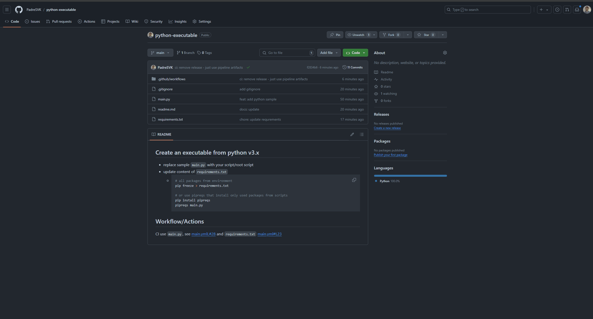

## Create an executable from python v3.x

* replace sample `main.py` with your script/root script
* update content of `requirements.txt`
  * ```sh
    # all packages from environment
    pip freeze > requirements.txt

    # or use pipreqs that install only used packaqes from scripts
    pip install pipreqs
    pipreqs main.py
    ```

## Workflow/Actions

CI use `main.py`, see [main.ymlL#28](./.github/workflows/main.yml#L28) and `requirements.txt` [main.yml#L23](./.github/workflows/main.yml#L23)

get artifacts

